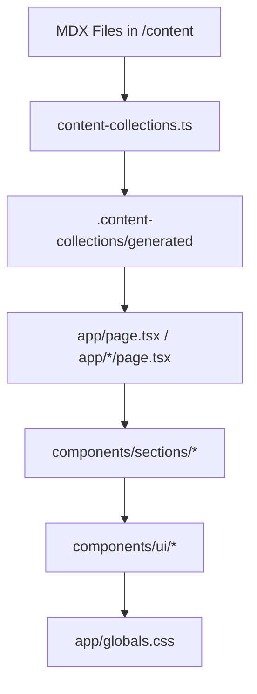

# Repository Intelligence Map — johnokyere.xyz

This map provides high-density context for autonomous agents to navigate, maintain, and scale the repository.

---

## 1. Core Intelligence Hubs (Critical Files)
| File | Agent Impact | Reason |
|---|---|---|
| `CLAUDE.md` | **MAX** | Primary guardrails, non-negotiable stack, and anti-patterns. |
| `content-collections.ts` | **HIGH** | Data schema source of truth. Changes break all MDX content. |
| `app/globals.css` | **HIGH** | Global token definitions and typography scale. |
| `config/site.ts` | **MEDIUM** | Identity and external link registry. |
| `.claude/WORKFLOWS.md` | **HIGH** | Execution playbooks and agent routing. |

---

## 2. Dependency & Content Flow

- **Pipeline**: MDX → Zod Validation → Compiled React Components → RSC Props.
- **State**: Content data is **never** in Zustand. Zustand only handles `media-viewer` state.

---

## 3. Rendering & State Boundaries
| Boundary | Strategy | Active Examples |
|---|---|---|
| **Server (RSC)** | Data reading, static layout. | `Experience`, `Writing`, `Awards`, `WorkListing`. |
| **Client** | Hooks, animations, state. | `About` (links), `SelectedWork` (hover), `Menu` (state), `Highlights` (carousel). |
| **State Sync** | Event-based. | `openMenu()` util triggers state inside `Menu.tsx`. |
| **Media Sync** | Global Store. | `useImageStore` triggers `ImageViewer` in `layout.tsx`. |

---

## 4. Design System Architecture
- **Tokens**: Semantic OKLCH tokens in `globals.css` reassigned via `.dark` class.
- **Spacing**: Enforced `52rem` max-width via `DashedVerticalLines` in `layout.tsx`.
- **Typography**: Scale defined in `@layer utilities` of `globals.css`.
- **Atomic Pattern**: `SectionGrid` → `SectionTitle` + `SectionContent`.

---

## 5. Frequently Reused Patterns
- **Hover Reveal**: `ProjectPreviewCard` pattern in `SelectedWork` and `Writing`.
- **Dashed Connectors**: `border-dashed` used as vertical/horizontal "wires" between components.
- **Media Lightbox**: Click handler → `useImageStore.setSelectedImage` → `setDialogOpen(true)`.
- **Sub-page Nav**: `sub-page-nav.tsx` used for secondary routes.

---

## 6. Risk Map & Bottlenecks
| Risk Area | Description | Scaling Bottleneck |
|---|---|---|
| **MDX Schema** | Adding required fields breaks the whole content layer. | Manual content updates don't scale; may need a CMS bridge later. |
| **Client Bloat** | Nesting Client Components creates massive client trees. | Hydration costs as interactivity increases. |
| **globals.css** | Single CSS file will become hard to maintain. | Tailwind v4 mitigates this, but complexity remains high. |
| **Animation Jank** | Animating non-transform properties. | Visual performance on low-end mobile devices. |

---

## 7. Agent Optimization Checklist
- [ ] **Data Check**: Did I verify the Zod schema in `content-collections.ts`?
- [ ] **Token Check**: Am I using `text-foreground` instead of `#hex`?
- [ ] **Boundary Check**: Is this `"use client"` directive actually necessary?
- [ ] **Width Check**: Does this break the `52rem` constraint?
- [ ] **Asset Check**: Are images using `next/image` with proper `utfs.io` domains?

---

## 8. Future Scaling Targets
1. **Content**: Move from local MDX to a headless CMS if content count > 100.
2. **State**: If UI complexity increases, move to more modular Zustand slices.
3. **Tests**: Implement Playwright for the `⌘K` menu and theme switching flows.
4. **i18n**: The current structure is English-only; would require `next-intl` refactor.

## 17. Autonomous Editing Rules

Before editing:
1. Read the entire target file
2. Identify dependent imports/usages
3. Check for existing patterns before introducing new ones
4. Preserve architecture consistency
5. Avoid introducing new abstractions unless repeated ≥3 times

After editing:
1. Re-read modified file
2. Check for type regressions
3. Check import ordering
4. Check dark/light compatibility
5. Check mobile responsiveness assumptions
6. Run typecheck mentally before suggesting commands